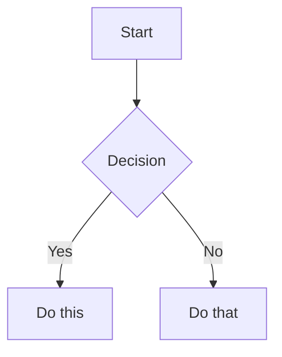

# Obsidian Vault Integration

The vault is managed via GitHub repository. All changes are made to the repo first, then synced to iCloud for other devices.

## Paths

| Location | Path |
|----------|------|
| **GitHub Repo (Primary)** | `/Users/leonardoaraujo/work/leo-obsidian-vault` |
| **iCloud (Sync Target)** | `/Users/leonardoaraujo/Library/Mobile Documents/iCloud~md~obsidian/Documents/Leo Knowledge` |
| **GitHub URL** | https://github.com/leonardoaraujosantos/leo-obsidian-vault.git |

## Obsidian CLI

```bash
CLI="/Applications/Obsidian.app/Contents/MacOS/Obsidian"
VAULT='vault="Leo Knowledge"'
```

---

## Workflow

```
┌─────────────────┐     ┌─────────────────┐     ┌─────────────────┐
│  GitHub Repo    │────▶│    iCloud       │────▶│  Other Devices  │
│  (Primary)      │     │  (Sync Target)  │     │  (iPhone, iPad) │
└─────────────────┘     └─────────────────┘     └─────────────────┘
```

**IMPORTANT:** Always make changes to the GitHub repo first, then sync.

---

## Top-Level Commands

These are the primary commands the user triggers with `/obsidian <command>`:

| User says | Action |
|-----------|--------|
| `/obsidian pull` | Pull iCloud changes → repo → commit → push to GitHub |
| `/obsidian push` | Commit repo changes → push to GitHub → rsync to iCloud |
| `/obsidian sync` | Full bidirectional: pull from iCloud first, then push to GitHub + iCloud |
| `/obsidian search <query>` | Search vault for content |

---

## Pull from iCloud (Mobile/iPad edits → Repo → GitHub)

**Triggered by:** `/obsidian pull`, "pull from iCloud", "bring iCloud changes"

Run these steps in order:

### 1. Check what changed
```bash
diff -rq /Users/leonardoaraujo/work/leo-obsidian-vault \
  "/Users/leonardoaraujo/Library/Mobile Documents/iCloud~md~obsidian/Documents/Leo Knowledge" \
  --exclude='.git' --exclude='.obsidian' --exclude='.smart-env' --exclude='.trash' --exclude='.DS_Store' 2>/dev/null | head -30
```

### 2. Pull changes from iCloud into repo
```bash
rsync -av --update \
  --exclude='.git/' \
  --exclude='.obsidian/workspace*.json' \
  --exclude='.smart-env/' \
  --exclude='.trash/' \
  --exclude='.DS_Store' \
  "/Users/leonardoaraujo/Library/Mobile Documents/iCloud~md~obsidian/Documents/Leo Knowledge/" \
  /Users/leonardoaraujo/work/leo-obsidian-vault/
```

### 3. Commit and push to GitHub
```bash
cd /Users/leonardoaraujo/work/leo-obsidian-vault && \
git add -A && \
git commit -m "Sync vault from iCloud: <brief description of changes>" && \
git push
```

### 4. Show the user a summary of what was pulled (new files, modified files)

---

## Push to GitHub + iCloud (Repo → GitHub → iCloud)

**Triggered by:** `/obsidian push`, "push vault", "sync to iCloud"

```bash
cd /Users/leonardoaraujo/work/leo-obsidian-vault && \
git add -A && \
git commit -m "Update vault: <brief description>" && \
git push && \
rsync -av --delete \
  --exclude='.git/' \
  --exclude='.DS_Store' \
  --exclude='.obsidian/workspace.json' \
  --exclude='.obsidian/workspace-mobile.json' \
  --exclude='.smart-env/' \
  --exclude='.trash/' \
  /Users/leonardoaraujo/work/leo-obsidian-vault/ \
  "/Users/leonardoaraujo/Library/Mobile Documents/iCloud~md~obsidian/Documents/Leo Knowledge/"
```

---

## Full Sync (Bidirectional)

**Triggered by:** `/obsidian sync`, "sync my vault"

1. First run the **Pull from iCloud** steps (to get mobile edits)
2. Then run the **Push to GitHub + iCloud** steps (to push everything out)

---

# Obsidian Flavored Markdown (.md)

Obsidian extends CommonMark and GFM with wikilinks, embeds, callouts, properties, comments, and other syntax. This section covers Obsidian-specific extensions — standard Markdown (headings, bold, italic, lists, quotes, code blocks, tables) is assumed knowledge.

## Workflow: Creating an Obsidian Note

1. **Add frontmatter** with properties (title, tags, aliases) at the top of the file
2. **Write content** using standard Markdown for structure, plus Obsidian-specific syntax below
3. **Link related notes** using wikilinks (`[[Note]]`) for internal vault connections; use Markdown links `[text](url)` for external URLs only
4. **Embed content** from other notes, images, or PDFs using `![[embed]]` syntax
5. **Add callouts** for highlighted information using `> [!type]` syntax

> When choosing between wikilinks and Markdown links: use `[[wikilinks]]` for notes within the vault (Obsidian tracks renames automatically) and `[text](url)` for external URLs only.

## Internal Links (Wikilinks)

```markdown
[[Note Name]]                          Link to note
[[Note Name|Display Text]]             Custom display text
[[Note Name#Heading]]                  Link to heading
[[Note Name#^block-id]]                Link to block
[[#Heading in same note]]              Same-note heading link
```

Define a block ID by appending `^block-id` to any paragraph:

```markdown
This paragraph can be linked to. ^my-block-id
```

For lists and quotes, place the block ID on a separate line after the block:

```markdown
> A quote block

^quote-id
```

## Embeds

Prefix any wikilink with `!` to embed its content inline:

```markdown
![[Note Name]]                         Embed full note
![[Note Name#Heading]]                 Embed section
![[Note Name#^block-id]]               Embed block
![[image.png]]                         Embed image
![[image.png|300]]                     Embed image with width
![[image.png|300x200]]                 Embed image with width x height
![[document.pdf#page=3]]               Embed PDF page
![[audio.mp3]]                         Embed audio player
![[video.mp4]]                         Embed video player
```

## Callouts

```markdown
> [!note]
> Basic callout.

> [!warning] Custom Title
> Callout with a custom title.

> [!faq]- Collapsed by default
> Foldable callout (- collapsed, + expanded).

> [!tip]+ Expanded by default
> Foldable, shown open.
```

Common types: `note`, `tip`, `warning`, `info`, `example`, `quote`, `bug`, `danger`, `success`, `failure`, `question`, `abstract`, `todo`, `important`, `caution`.

Callouts can be nested by increasing the `>` depth:

```markdown
> [!note] Outer
> Outer content.
> > [!tip] Inner
> > Inner content.
```

## Properties (Frontmatter)

```yaml
---
title: My Note
date: 2024-01-15
tags:
  - project
  - active
aliases:
  - Alternative Name
cssclasses:
  - custom-class
status: in-progress
---
```

Default properties:
- `tags` — searchable labels
- `aliases` — alternative note names for link suggestions
- `cssclasses` — CSS classes for styling

Supported property types: text, list, number, checkbox, date, datetime.

## Tags

```markdown
#tag                    Inline tag
#nested/tag             Nested tag with hierarchy
#project/2024/q1        Multi-level hierarchy
```

Tags can contain letters, numbers (not first character), underscores, hyphens, and forward slashes. Tags can also be defined in frontmatter under the `tags` property (without the `#`).

## Comments

```markdown
This is visible %%but this is hidden%% text.

%%
This entire block is hidden in reading view.
%%
```

## Obsidian-Specific Formatting

```markdown
==Highlighted text==                   Highlight syntax
```

## Math (LaTeX)

```markdown
Inline: $e^{i\pi} + 1 = 0$

Block:
$$
\frac{a}{b} = c
$$
```

## Diagrams (Mermaid)

````markdown

````

To link Mermaid nodes to Obsidian notes, add `class NodeName internal-link;`.

## Footnotes

```markdown
Text with a footnote[^1].

[^1]: Footnote content.

Inline footnote.^[This is inline.]
```

## Complete Markdown Example

````markdown
---
title: Project Alpha
date: 2024-01-15
tags:
  - project
  - active
status: in-progress
---

# Project Alpha

This project aims to [[improve workflow]] using modern techniques.

> [!important] Key Deadline
> The first milestone is due on ==January 30th==.

## Tasks

- [x] Initial planning
- [ ] Development phase
  - [ ] Backend implementation
  - [ ] Frontend design

## Notes

The algorithm uses $O(n \log n)$ sorting. See [[Algorithm Notes#Sorting]] for details.

![[Architecture Diagram.png|600]]

Reviewed in [[Meeting Notes 2024-01-10#Decisions]].
````

---

# Obsidian Bases (.base)

Bases are database-like views of notes, defined in `.base` YAML files.

## Workflow

1. **Create the file**: Create a `.base` file in the vault with valid YAML content
2. **Define scope**: Add `filters` to select which notes appear (by tag, folder, property, or date)
3. **Add formulas** (optional): Define computed properties in the `formulas` section
4. **Configure views**: Add one or more views (`table`, `cards`, `list`, or `map`) with `order` specifying which properties to display
5. **Validate**: Verify the file is valid YAML. Check that all referenced properties and formulas exist. Common issues: unquoted strings containing special YAML characters, mismatched quotes in formula expressions, referencing `formula.X` without defining `X` in `formulas`
6. **Test in Obsidian**: Open the `.base` file in Obsidian to confirm the view renders

## Schema

```yaml
# Global filters apply to ALL views in the base
filters:
  and: []
  or: []
  not: []

# Define formula properties that can be used across all views
formulas:
  formula_name: 'expression'

# Configure display names and settings for properties
properties:
  property_name:
    displayName: "Display Name"
  formula.formula_name:
    displayName: "Formula Display Name"
  file.ext:
    displayName: "Extension"

# Define custom summary formulas
summaries:
  custom_summary_name: 'values.mean().round(3)'

# Define one or more views
views:
  - type: table | cards | list | map
    name: "View Name"
    limit: 10
    groupBy:
      property: property_name
      direction: ASC | DESC
    filters:
      and: []
    order:
      - file.name
      - property_name
      - formula.formula_name
    summaries:
      property_name: Average
```

## Filter Syntax

```yaml
# Single filter
filters: 'status == "done"'

# AND - all conditions must be true
filters:
  and:
    - 'status == "done"'
    - 'priority > 3'

# OR - any condition can be true
filters:
  or:
    - 'file.hasTag("book")'
    - 'file.hasTag("article")'

# NOT - exclude matching items
filters:
  not:
    - 'file.hasTag("archived")'

# Nested filters
filters:
  or:
    - file.hasTag("tag")
    - and:
        - file.hasTag("book")
        - file.hasLink("Textbook")
    - not:
        - file.hasTag("book")
        - file.inFolder("Required Reading")
```

### Filter Operators

| Operator | Description |
|----------|-------------|
| `==` | equals |
| `!=` | not equal |
| `>` | greater than |
| `<` | less than |
| `>=` | greater than or equal |
| `<=` | less than or equal |
| `&&` | logical and |
| `\|\|` | logical or |
| `!` | logical not |

## Property Types

1. **Note properties** — From frontmatter: `note.author` or just `author`
2. **File properties** — File metadata: `file.name`, `file.mtime`, etc.
3. **Formula properties** — Computed: `formula.my_formula`

### File Properties Reference

| Property | Type | Description |
|----------|------|-------------|
| `file.name` | String | File name |
| `file.basename` | String | File name without extension |
| `file.path` | String | Full path to file |
| `file.folder` | String | Parent folder path |
| `file.ext` | String | File extension |
| `file.size` | Number | File size in bytes |
| `file.ctime` | Date | Created time |
| `file.mtime` | Date | Modified time |
| `file.tags` | List | All tags in file |
| `file.links` | List | Internal links in file |
| `file.backlinks` | List | Files linking to this file |
| `file.embeds` | List | Embeds in the note |
| `file.properties` | Object | All frontmatter properties |

### The `this` Keyword

- In main content area: refers to the base file itself
- When embedded: refers to the embedding file
- In sidebar: refers to the active file in main content

## Formulas

```yaml
formulas:
  # Arithmetic
  total: "price * quantity"

  # Conditional
  status_icon: 'if(done, "✅", "⏳")'

  # String formatting
  formatted_price: 'if(price, price.toFixed(2) + " dollars")'

  # Date formatting
  created: 'file.ctime.format("YYYY-MM-DD")'

  # Days since created (use .days for Duration)
  days_old: '(now() - file.ctime).days'

  # Days until due date
  days_until_due: 'if(due_date, (date(due_date) - today()).days, "")'
```

### Key Functions

| Function | Signature | Description |
|----------|-----------|-------------|
| `date()` | `date(string): date` | Parse string to date (`YYYY-MM-DD HH:mm:ss`) |
| `now()` | `now(): date` | Current date and time |
| `today()` | `today(): date` | Current date (time = 00:00:00) |
| `if()` | `if(condition, trueResult, falseResult?)` | Conditional |
| `duration()` | `duration(string): duration` | Parse duration string |
| `file()` | `file(path): file` | Get file object |
| `link()` | `link(path, display?): Link` | Create a link |

### Duration Type

Subtracting two dates returns a **Duration**, not a number.

Duration fields: `.days`, `.hours`, `.minutes`, `.seconds`, `.milliseconds`

**IMPORTANT:** Duration does NOT support `.round()`, `.floor()`, `.ceil()` directly. Access a numeric field first, then apply number functions.

```yaml
# CORRECT
"(date(due_date) - today()).days"
"(now() - file.ctime).days"
"(date(due_date) - today()).days.round(0)"

# WRONG
# "((date(due) - today()) / 86400000).round(0)"
```

### Date Arithmetic

```yaml
# Duration units: y/year/years, M/month/months, d/day/days,
#                 w/week/weeks, h/hour/hours, m/minute/minutes, s/second/seconds
"now() + \"1 day\""       # Tomorrow
"today() + \"7d\""        # A week from today
"now() - file.ctime"      # Returns Duration
"(now() - file.ctime).days"  # Days as number
```

## View Types

### Table View

```yaml
views:
  - type: table
    name: "My Table"
    order:
      - file.name
      - status
      - due_date
    summaries:
      price: Sum
      count: Average
```

### Cards View

```yaml
views:
  - type: cards
    name: "Gallery"
    order:
      - file.name
      - cover_image
      - description
```

### List View

```yaml
views:
  - type: list
    name: "Simple List"
    order:
      - file.name
      - status
```

### Map View

Requires latitude/longitude properties and the Maps community plugin.

```yaml
views:
  - type: map
    name: "Locations"
```

## Default Summary Formulas

| Name | Input Type | Description |
|------|------------|-------------|
| `Average` | Number | Mathematical mean |
| `Min` | Number | Smallest number |
| `Max` | Number | Largest number |
| `Sum` | Number | Sum of all numbers |
| `Range` | Number/Date | Max - Min / Latest - Earliest |
| `Median` | Number | Mathematical median |
| `Stddev` | Number | Standard deviation |
| `Earliest` | Date | Earliest date |
| `Latest` | Date | Latest date |
| `Checked` | Boolean | Count of true values |
| `Unchecked` | Boolean | Count of false values |
| `Empty` | Any | Count of empty values |
| `Filled` | Any | Count of non-empty values |
| `Unique` | Any | Count of unique values |

## Complete Base Examples

### Task Tracker

```yaml
filters:
  and:
    - file.hasTag("task")
    - 'file.ext == "md"'

formulas:
  days_until_due: 'if(due, (date(due) - today()).days, "")'
  is_overdue: 'if(due, date(due) < today() && status != "done", false)'
  priority_label: 'if(priority == 1, "🔴 High", if(priority == 2, "🟡 Medium", "🟢 Low"))'

properties:
  status:
    displayName: Status
  formula.days_until_due:
    displayName: "Days Until Due"
  formula.priority_label:
    displayName: Priority

views:
  - type: table
    name: "Active Tasks"
    filters:
      and:
        - 'status != "done"'
    order:
      - file.name
      - status
      - formula.priority_label
      - due
      - formula.days_until_due
    groupBy:
      property: status
      direction: ASC
    summaries:
      formula.days_until_due: Average

  - type: table
    name: "Completed"
    filters:
      and:
        - 'status == "done"'
    order:
      - file.name
      - completed_date
```

### Reading List

```yaml
filters:
  or:
    - file.hasTag("book")
    - file.hasTag("article")

formulas:
  reading_time: 'if(pages, (pages * 2).toString() + " min", "")'
  status_icon: 'if(status == "reading", "📖", if(status == "done", "✅", "📚"))'

views:
  - type: cards
    name: "Library"
    order:
      - cover
      - file.name
      - author
      - formula.status_icon

  - type: table
    name: "Reading List"
    filters:
      and:
        - 'status == "to-read"'
    order:
      - file.name
      - author
      - pages
      - formula.reading_time
```

### Daily Notes Index

```yaml
filters:
  and:
    - file.inFolder("Journal/Daily")
    - '/^\d{4}-\d{2}-\d{2}$/.matches(file.basename)'

formulas:
  word_estimate: '(file.size / 5).round(0)'
  day_of_week: 'date(file.basename).format("dddd")'

views:
  - type: table
    name: "Recent Notes"
    limit: 30
    order:
      - file.name
      - formula.day_of_week
      - formula.word_estimate
      - file.mtime
```

## Embedding Bases

```markdown
![[MyBase.base]]

<!-- Specific view -->
![[MyBase.base#View Name]]
```

## YAML Quoting Rules

- Use single quotes for formulas containing double quotes: `'if(done, "Yes", "No")'`
- Use double quotes for simple strings: `"My View Name"`
- Escape nested quotes in complex expressions

## Bases Troubleshooting

**Unquoted special characters**: Strings containing `:`, `{`, `}`, `[`, `]`, `,`, `&`, `*`, `#`, `?`, `|`, `-`, `<`, `>`, `=`, `!`, `%`, `@`, `` ` `` must be quoted.

```yaml
# WRONG - colon in unquoted string
displayName: Status: Active

# CORRECT
displayName: "Status: Active"
```

**Mismatched quotes in formulas**: When a formula contains double quotes, wrap the entire formula in single quotes.

```yaml
# WRONG
label: "if(done, "Yes", "No")"

# CORRECT
label: 'if(done, "Yes", "No")'
```

**Duration math without field access**: Always access `.days`, `.hours`, etc. before applying number functions.

**Missing null checks**: Guard property access with `if()` to avoid crashes on notes without the property.

**Referencing undefined formulas**: Every `formula.X` in `order` or `properties` must have a matching entry in `formulas`.

---

# JSON Canvas (.canvas)

Canvas files (`.canvas`) follow the [JSON Canvas Spec 1.0](https://jsoncanvas.org/spec/1.0/) and contain two top-level arrays:

```json
{
  "nodes": [],
  "edges": []
}
```

## Canvas Workflows

### Create a New Canvas

1. Create a `.canvas` file with `{"nodes": [], "edges": []}`
2. Generate unique 16-character hex IDs per node (e.g., `"6f0ad84f44ce9c17"`)
3. Add nodes with required fields: `id`, `type`, `x`, `y`, `width`, `height`
4. Add edges referencing valid node IDs via `fromNode` and `toNode`
5. Validate: parse the JSON; verify all edge references resolve

### Add a Node

1. Read and parse the `.canvas` file
2. Generate a unique ID that doesn't collide with existing nodes/edges
3. Choose `x`, `y` that avoid overlapping existing nodes (50-100px spacing)
4. Append node to `nodes`; optionally add edges

### Connect Two Nodes

1. Identify source/target node IDs
2. Generate a unique edge ID
3. Set `fromNode`, `toNode`; optionally `fromSide`/`toSide` (`top`, `right`, `bottom`, `left`)
4. Optionally set `label` for descriptive text
5. Append the edge to `edges`

## Nodes

Array order determines z-index: first = bottom layer, last = top layer.

### Generic Node Attributes

| Attribute | Required | Type | Description |
|-----------|----------|------|-------------|
| `id` | Yes | string | Unique 16-char hex identifier |
| `type` | Yes | string | `text`, `file`, `link`, or `group` |
| `x` | Yes | integer | X position in pixels |
| `y` | Yes | integer | Y position in pixels |
| `width` | Yes | integer | Width in pixels |
| `height` | Yes | integer | Height in pixels |
| `color` | No | canvasColor | Preset `"1"`-`"6"` or hex (`"#FF0000"`) |

### Text Nodes

```json
{
  "id": "6f0ad84f44ce9c17",
  "type": "text",
  "x": 0,
  "y": 0,
  "width": 400,
  "height": 200,
  "text": "# Hello World\n\nThis is **Markdown** content."
}
```

**Newline pitfall**: Use `\n` for line breaks in JSON strings. Do NOT use `\\n` — Obsidian renders that as the literal characters `\` and `n`.

### File Nodes

| Attribute | Required | Type | Description |
|-----------|----------|------|-------------|
| `file` | Yes | string | Path to file within the vault |
| `subpath` | No | string | Link to heading or block (starts with `#`) |

```json
{
  "id": "a1b2c3d4e5f67890",
  "type": "file",
  "x": 500,
  "y": 0,
  "width": 400,
  "height": 300,
  "file": "Attachments/diagram.png"
}
```

### Link Nodes

```json
{
  "id": "c3d4e5f678901234",
  "type": "link",
  "x": 1000,
  "y": 0,
  "width": 400,
  "height": 200,
  "url": "https://obsidian.md"
}
```

### Group Nodes

| Attribute | Required | Type | Description |
|-----------|----------|------|-------------|
| `label` | No | string | Text label for the group |
| `background` | No | string | Path to background image |
| `backgroundStyle` | No | string | `cover`, `ratio`, or `repeat` |

```json
{
  "id": "d4e5f6789012345a",
  "type": "group",
  "x": -50,
  "y": -50,
  "width": 1000,
  "height": 600,
  "label": "Project Overview",
  "color": "4"
}
```

## Edges

| Attribute | Required | Type | Default | Description |
|-----------|----------|------|---------|-------------|
| `id` | Yes | string | - | Unique identifier |
| `fromNode` | Yes | string | - | Source node ID |
| `fromSide` | No | string | - | `top`, `right`, `bottom`, `left` |
| `fromEnd` | No | string | `none` | `none` or `arrow` |
| `toNode` | Yes | string | - | Target node ID |
| `toSide` | No | string | - | `top`, `right`, `bottom`, `left` |
| `toEnd` | No | string | `arrow` | `none` or `arrow` |
| `color` | No | canvasColor | - | Line color |
| `label` | No | string | - | Text label |

```json
{
  "id": "0123456789abcdef",
  "fromNode": "6f0ad84f44ce9c17",
  "fromSide": "right",
  "toNode": "a1b2c3d4e5f67890",
  "toSide": "left",
  "toEnd": "arrow",
  "label": "leads to"
}
```

## Canvas Colors

Accepts a hex string or a preset number:

| Preset | Color |
|--------|-------|
| `"1"` | Red |
| `"2"` | Orange |
| `"3"` | Yellow |
| `"4"` | Green |
| `"5"` | Cyan |
| `"6"` | Purple |

## Canvas Layout Guidelines

- Coordinates can be negative (canvas extends infinitely)
- `x` increases right, `y` increases down; position is the top-left corner
- Space nodes 50-100px apart; leave 20-50px padding inside groups
- Align to grid (multiples of 10 or 20) for cleaner layouts

| Node Type | Suggested Width | Suggested Height |
|-----------|-----------------|------------------|
| Small text | 200-300 | 80-150 |
| Medium text | 300-450 | 150-300 |
| Large text | 400-600 | 300-500 |
| File preview | 300-500 | 200-400 |
| Link preview | 250-400 | 100-200 |

## Canvas Validation Checklist

1. All `id` values unique across both nodes and edges
2. Every `fromNode` and `toNode` references an existing node ID
3. Required fields present per node type (`text`, `file`, `url`)
4. `type` is `text`, `file`, `link`, or `group`
5. `fromSide`/`toSide` values are `top`, `right`, `bottom`, `left`
6. `fromEnd`/`toEnd` values are `none` or `arrow`
7. Color presets are `"1"`-`"6"` or valid hex
8. JSON parses cleanly

### ID Generation

Generate 16-character lowercase hexadecimal strings (64-bit random value):

```bash
# In shell
openssl rand -hex 8

# Or in JS via obsidian eval
obsidian eval code="crypto.randomUUID().replace(/-/g, '').slice(0, 16)"
```

---

# Obsidian CLI Reference

## CLI Syntax

**Parameters** take a value with `=`. Quote values with spaces:

```bash
obsidian create name="My Note" content="Hello world"
```

**Flags** are boolean switches with no value:

```bash
obsidian create name="My Note" silent overwrite
```

For multiline content use `\n` for newline and `\t` for tab.

## File Targeting

Many commands accept `file` or `path` to target a file. Without either, the active file is used.

- `file=<name>` — resolves like a wikilink (name only, no path or extension)
- `path=<path>` — exact path from vault root, e.g. `folder/note.md`

## Vault Targeting

Commands target the most recently focused vault by default. Use `vault=<name>` as the first parameter:

```bash
obsidian vault="Leo Knowledge" search query="test"
```

## Common Flags

| Flag | Purpose |
|------|---------|
| `silent` | Prevent files from opening in UI |
| `--copy` | Copy command output to clipboard |
| `total` | Return a count on list commands |
| `overwrite` | Allow overwriting existing files on create |

## Quick Commands Reference

| Action | Command |
|--------|---------|
| Search vault | `$CLI search $VAULT query="keyword"` |
| Search with context | `$CLI search:context $VAULT query="keyword" limit=10` |
| Read file | `$CLI read $VAULT file="NoteName"` |
| Read by path | `$CLI read $VAULT path="Folder/Note.md"` |
| List files | `$CLI files $VAULT` |
| List folders | `$CLI folders $VAULT` |
| List tags | `$CLI tags $VAULT counts` |
| Vault info | `$CLI vault $VAULT` |
| Recent files | `$CLI recents $VAULT` |
| Random note | `$CLI random:read $VAULT` |

Run `obsidian help` at any time for the full, up-to-date command list.

## Reading Notes

### Using CLI (preferred for search)
```bash
# Search for content
/Applications/Obsidian.app/Contents/MacOS/Obsidian search vault="Leo Knowledge" query="kubernetes"

# Search with context (shows matching lines)
/Applications/Obsidian.app/Contents/MacOS/Obsidian search:context vault="Leo Knowledge" query="kubernetes" limit=10

# Read by name (wikilink style)
/Applications/Obsidian.app/Contents/MacOS/Obsidian read vault="Leo Knowledge" file="Python"

# Read by path
/Applications/Obsidian.app/Contents/MacOS/Obsidian read vault="Leo Knowledge" path="Programming/Python.md"
```

### Using File Tools (for editing)
```bash
# Read a specific file
Read: /Users/leonardoaraujo/work/leo-obsidian-vault/Programming/Python/Python.md

# Search for files by pattern
Glob: /Users/leonardoaraujo/work/leo-obsidian-vault/**/*.md

# Search for content
Grep: pattern="kubernetes" path="/Users/leonardoaraujo/work/leo-obsidian-vault"
```

## Writing/Creating Notes

Use Write or Edit tools on the **GitHub repo**, then sync:

```bash
# Create new file
Write: /Users/leonardoaraujo/work/leo-obsidian-vault/Programming/NewNote.md

# Edit existing file
Edit: /Users/leonardoaraujo/work/leo-obsidian-vault/Programming/Python/Python.md
```

## Links & Backlinks

```bash
# List backlinks to a file
/Applications/Obsidian.app/Contents/MacOS/Obsidian backlinks vault="Leo Knowledge" file="Python"

# List outgoing links
/Applications/Obsidian.app/Contents/MacOS/Obsidian links vault="Leo Knowledge" file="Python"

# Get note outline (headings)
/Applications/Obsidian.app/Contents/MacOS/Obsidian outline vault="Leo Knowledge" file="Python"
```

## Vault Health Checks

```bash
# Orphan notes (no incoming links)
/Applications/Obsidian.app/Contents/MacOS/Obsidian orphans vault="Leo Knowledge"

# Dead-end notes (no outgoing links)
/Applications/Obsidian.app/Contents/MacOS/Obsidian deadends vault="Leo Knowledge"

# Broken/unresolved links
/Applications/Obsidian.app/Contents/MacOS/Obsidian unresolved vault="Leo Knowledge" verbose
/Applications/Obsidian.app/Contents/MacOS/Obsidian unresolved vault="Leo Knowledge" counts
```

## Tasks

```bash
# List all tasks
/Applications/Obsidian.app/Contents/MacOS/Obsidian tasks vault="Leo Knowledge"

# Incomplete
/Applications/Obsidian.app/Contents/MacOS/Obsidian tasks vault="Leo Knowledge" todo

# Completed
/Applications/Obsidian.app/Contents/MacOS/Obsidian tasks vault="Leo Knowledge" done

# Tasks from daily note
/Applications/Obsidian.app/Contents/MacOS/Obsidian tasks vault="Leo Knowledge" daily

# Toggle a task
/Applications/Obsidian.app/Contents/MacOS/Obsidian task vault="Leo Knowledge" file="MyNote" line=5 toggle
```

## Daily Notes

Daily notes are stored in: `Journal/Daily/YYYY-MM/YYYY-MM-DD.md`

```bash
# Read today's daily note
/Applications/Obsidian.app/Contents/MacOS/Obsidian daily:read vault="Leo Knowledge"

# Append to daily note
/Applications/Obsidian.app/Contents/MacOS/Obsidian daily:append vault="Leo Knowledge" content="- [ ] New task"

# Get daily note path
/Applications/Obsidian.app/Contents/MacOS/Obsidian daily:path vault="Leo Knowledge"
```

## Properties (Frontmatter) via CLI

```bash
# List all properties in vault
/Applications/Obsidian.app/Contents/MacOS/Obsidian properties vault="Leo Knowledge" counts

# Read property from file
/Applications/Obsidian.app/Contents/MacOS/Obsidian property:read vault="Leo Knowledge" file="Python" name="tags"

# Set property on file
/Applications/Obsidian.app/Contents/MacOS/Obsidian property:set vault="Leo Knowledge" file="Python" name="status" value="reviewed"
```

## Templates

```bash
# List templates
/Applications/Obsidian.app/Contents/MacOS/Obsidian templates vault="Leo Knowledge"

# Read template
/Applications/Obsidian.app/Contents/MacOS/Obsidian template:read vault="Leo Knowledge" name="Meeting"

# Create with template
/Applications/Obsidian.app/Contents/MacOS/Obsidian create vault="Leo Knowledge" name="Meeting Notes" template="Meeting"
```

## Plugin & Theme Development

When making code changes to a plugin or theme, follow this develop/test cycle:

1. **Reload** the plugin to pick up changes:
   ```bash
   obsidian plugin:reload id=my-plugin
   ```
2. **Check for errors** — if errors appear, fix and repeat:
   ```bash
   obsidian dev:errors
   ```
3. **Verify visually** with a screenshot or DOM inspection:
   ```bash
   obsidian dev:screenshot path=screenshot.png
   obsidian dev:dom selector=".workspace-leaf" text
   ```
4. **Check console output** for warnings/logs:
   ```bash
   obsidian dev:console level=error
   ```

### Additional Developer Commands

Run JavaScript in the app context:

```bash
obsidian eval code="app.vault.getFiles().length"
```

Inspect CSS values:

```bash
obsidian dev:css selector=".workspace-leaf" prop=background-color
```

Toggle mobile emulation:

```bash
obsidian dev:mobile on
```

Run `obsidian help` for additional developer commands (CDP, debugger controls).

---

## Syncing Changes (Manual Recipes)

### Full Sync (Repo → GitHub → iCloud)

```bash
cd /Users/leonardoaraujo/work/leo-obsidian-vault && \
git add -A && \
git commit -m "Update vault" && \
git push && \
rsync -av --delete \
  --exclude='.git/' \
  --exclude='.DS_Store' \
  --exclude='.obsidian/workspace.json' \
  --exclude='.obsidian/workspace-mobile.json' \
  --exclude='.smart-env/' \
  --exclude='.trash/' \
  /Users/leonardoaraujo/work/leo-obsidian-vault/ \
  "/Users/leonardoaraujo/Library/Mobile Documents/iCloud~md~obsidian/Documents/Leo Knowledge/"
```

### Pull from iCloud (Mobile edits → Repo)

```bash
rsync -av --update \
  --exclude='.git/' \
  --exclude='.obsidian/workspace*.json' \
  --exclude='.smart-env/' \
  --exclude='.trash/' \
  "/Users/leonardoaraujo/Library/Mobile Documents/iCloud~md~obsidian/Documents/Leo Knowledge/" \
  /Users/leonardoaraujo/work/leo-obsidian-vault/
```

### Check for Conflicts

```bash
diff -rq /Users/leonardoaraujo/work/leo-obsidian-vault \
  "/Users/leonardoaraujo/Library/Mobile Documents/iCloud~md~obsidian/Documents/Leo Knowledge" \
  --exclude='.git' --exclude='.obsidian' --exclude='.smart-env' --exclude='.trash' 2>/dev/null | head -20
```

---

## Storage Analysis

```bash
# Total vault size
du -sh "/Users/leonardoaraujo/Library/Mobile Documents/iCloud~md~obsidian/Documents/Leo Knowledge"

# Size by folder
du -sh "/Users/leonardoaraujo/Library/Mobile Documents/iCloud~md~obsidian/Documents/Leo Knowledge"/* | sort -hr | head -20

# Largest files
find "/Users/leonardoaraujo/Library/Mobile Documents/iCloud~md~obsidian/Documents/Leo Knowledge" -type f -exec du -h {} + 2>/dev/null | sort -hr | head -20

# Clean Smart Connections cache (regenerates automatically)
rm -rf "/Users/leonardoaraujo/Library/Mobile Documents/iCloud~md~obsidian/Documents/Leo Knowledge/.smart-env"
```

---

## Backup

```bash
# Create timestamped backup
mkdir -p ~/Downloads/VaultBackup && \
cd "/Users/leonardoaraujo/Library/Mobile Documents/iCloud~md~obsidian/Documents" && \
zip -r ~/Downloads/VaultBackup/"Leo_Knowledge_$(date +%Y-%m-%d_%H-%M-%S).zip" "Leo Knowledge" \
  -x "*.DS_Store" -x "*/.obsidian/workspace*.json" -x "*/.smart-env/*"

# List backups
ls -lah ~/Downloads/VaultBackup/*.zip 2>/dev/null

# Delete old backups (keep last 5)
cd ~/Downloads/VaultBackup && ls -t *.zip 2>/dev/null | tail -n +6 | xargs rm -f 2>/dev/null
```

---

## Vault Structure

| Folder | Content |
|--------|---------|
| Programming | Languages, frameworks, web dev |
| ML Artificial Intelligence | AI/ML, deep learning |
| Infrastructure | Docker, Kubernetes, Terraform |
| Databases | SQL, NoSQL, data modeling |
| Blockchain | Crypto, DeFi, smart contracts |
| Engineering | Electronics, power, control |
| Robotics | ROS, motion planning, embedded |
| Cybersecurity | Security, pentesting |
| Mathematics | Math topics |
| Physics | Physics notes |
| Biology | Bio, bioinformatics |
| Finances | Markets, trading, DeFi |
| Game Development | Unity, Unreal |
| People | Personal info, family |
| Amini | Amini project notes |
| Cyberdyne | Cyberdyne project notes |
| **Things to Study** | Topics/videos to learn |

---

## Things to Study Folder

Location: `/Users/leonardoaraujo/work/leo-obsidian-vault/Things to Study/`

Used to track topics, videos, courses, and articles to study. **Managed primarily by the `/study-this` skill.**

### Status Lifecycle

| Status | Meaning |
|--------|---------|
| `pending` | Not started yet |
| `in_progress` | Currently studying |
| `consolidated` | Finished studying, learnings merged back into vault knowledge notes |

### Frontmatter fields
- **status**: `pending`, `in_progress`, `consolidated`
- **priority**: `high`, `medium`, `low`
- **category**: Programming, AI, Engineering, etc.
- **source**: YouTube, Website, PDF, Mixed
- **date_added**: when the study item was created
- **date_consolidated**: when learnings were merged back into vault (set by `/study-this consolidate`)

### Integration with `/study-this` skill

- **Adding study items:** Use `/study-this <urls>` — it fetches metadata, checks existing vault knowledge, creates the note, and adds a Google Task to "Learn and Try"
- **Consolidating:** Use `/study-this consolidate <topic>` — merges learnings from the study note back into vault knowledge notes, marks status as `consolidated`, and completes the Google Task
- **Manual creation:** Can also create notes directly here using the template below

### Template (for manual creation)
```markdown
---
status: pending
priority: medium
category:
source:
date_added: YYYY-MM-DD
---

# Topic Name

## Why Study This

## Existing Knowledge in Vault

## References

## Key Points

## Notes

## Action Items
- [ ] Watch/Read the material
- [ ] Take notes
- [ ] Practice/Apply
```

### List study items by status
```bash
# All study notes
ls "/Users/leonardoaraujo/work/leo-obsidian-vault/Things to Study/"

# Find pending items
Grep: pattern="status: pending" path="/Users/leonardoaraujo/work/leo-obsidian-vault/Things to Study" glob="*.md"

# Find consolidated items
Grep: pattern="status: consolidated" path="/Users/leonardoaraujo/work/leo-obsidian-vault/Things to Study" glob="*.md"
```

---

## Usage Examples

When user asks:
- "Pull from iCloud" / "Bring iCloud changes" → Run **Pull from iCloud** steps
- "Push vault" / "Sync to iCloud" → Run **Push** steps
- "Sync my vault" → Run **Full Sync** (pull then push)
- "Search for Docker notes" → Use CLI `search` or Grep
- "What's in my Python notes?" → Use CLI `read` or Read tool
- "Add a note about React hooks" → Use Write tool with Obsidian Flavored Markdown, then push
- "Create a Base for my reading list" → Write a `.base` YAML file per the Bases section
- "Make a mind map of this topic" → Create a `.canvas` JSON file per the Canvas section
- "What links to my Kubernetes note?" → Use CLI `backlinks`
- "List my incomplete tasks" → Use CLI `tasks todo`
- "Find broken links" → Use CLI `unresolved`
- "Add to today's daily note" → Use CLI `daily:append`
- "Backup my vault" → Run the backup ZIP command
- "Check vault storage" → Run storage analysis
- "Add video to study list" → Use `/study-this` skill instead
- "What study items are pending?" → Grep for `status: pending` in Things to Study

---

## Important Reminders

1. **Primary path:** `/Users/leonardoaraujo/work/leo-obsidian-vault`
2. **After changes:** Run sync to push to GitHub and iCloud
3. **File formats:** `.md` (Markdown), `.base` (Bases YAML), `.canvas` (Canvas JSON)
4. **Linking:** Wiki-style links `[[Note Name]]` for internal; Markdown `[text](url)` for external
5. **Frontmatter:** YAML with tags and metadata
6. **Use CLI for:** Search, backlinks, tasks, health checks, plugin development
7. **Use File tools for:** Reading/writing note content, editing `.base`/`.canvas` files

## References

- [Obsidian Flavored Markdown](https://help.obsidian.md/obsidian-flavored-markdown)
- [Callouts](https://help.obsidian.md/callouts)
- [Properties](https://help.obsidian.md/properties)
- [Bases Syntax](https://help.obsidian.md/bases/syntax)
- [Bases Functions](https://help.obsidian.md/bases/functions)
- [Bases Views](https://help.obsidian.md/bases/views)
- [JSON Canvas Spec 1.0](https://jsoncanvas.org/spec/1.0/)
- [Obsidian CLI](https://help.obsidian.md/cli)
