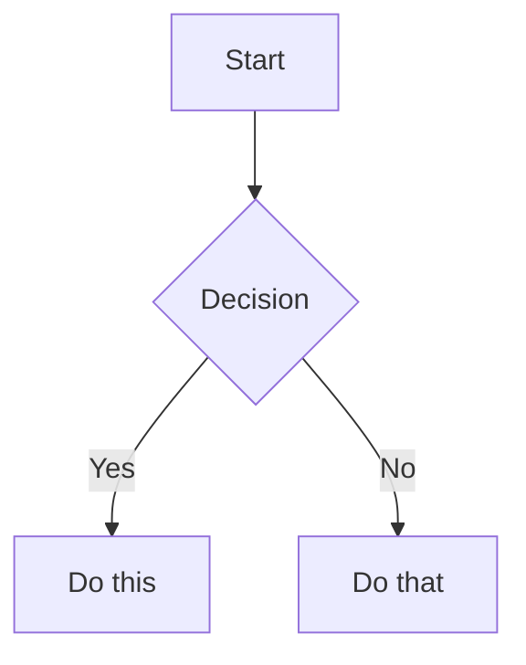

# Obsidian Flavored Markdown (.md)

> Config variables used below (`$OBSIDIAN_VAULT`, `$OBSIDIAN_VAULT_NAME`, `$OBSIDIAN_ICLOUD`, `$CLI`) are defined in the obsidian skill's [SKILL.md](../SKILL.md#configuration).

Obsidian extends CommonMark and GFM with wikilinks, embeds, callouts, properties, comments, and other syntax. This section covers Obsidian-specific extensions — standard Markdown (headings, bold, italic, lists, quotes, code blocks, tables) is assumed knowledge.

## Workflow: Creating an Obsidian Note

1. **Add frontmatter** with properties (title, tags, aliases) at the top of the file
2. **Write content** using standard Markdown for structure, plus Obsidian-specific syntax below
3. **Link related notes** using wikilinks (`[[Note]]`) for internal vault connections; use Markdown links `[text](url)` for external URLs only
4. **Embed content** from other notes, images, or PDFs using `![[embed]]` syntax
5. **Add callouts** for highlighted information using `> [!type]` syntax

> When choosing between wikilinks and Markdown links: use `[[wikilinks]]` for notes within the vault (Obsidian tracks renames automatically) and `[text](url)` for external URLs only.

## Internal Links (Wikilinks)

```markdown
[[Note Name]]                          Link to note
[[Note Name|Display Text]]             Custom display text
[[Note Name#Heading]]                  Link to heading
[[Note Name#^block-id]]                Link to block
[[#Heading in same note]]              Same-note heading link
```

Define a block ID by appending `^block-id` to any paragraph:

```markdown
This paragraph can be linked to. ^my-block-id
```

For lists and quotes, place the block ID on a separate line after the block:

```markdown
> A quote block

^quote-id
```

## Embeds

Prefix any wikilink with `!` to embed its content inline:

```markdown
![[Note Name]]                         Embed full note
![[Note Name#Heading]]                 Embed section
![[Note Name#^block-id]]               Embed block
![[image.png]]                         Embed image
![[image.png|300]]                     Embed image with width
![[image.png|300x200]]                 Embed image with width x height
![[document.pdf#page=3]]               Embed PDF page
![[audio.mp3]]                         Embed audio player
![[video.mp4]]                         Embed video player
```

## Callouts

```markdown
> [!note]
> Basic callout.

> [!warning] Custom Title
> Callout with a custom title.

> [!faq]- Collapsed by default
> Foldable callout (- collapsed, + expanded).

> [!tip]+ Expanded by default
> Foldable, shown open.
```

Common types: `note`, `tip`, `warning`, `info`, `example`, `quote`, `bug`, `danger`, `success`, `failure`, `question`, `abstract`, `todo`, `important`, `caution`.

Callouts can be nested by increasing the `>` depth:

```markdown
> [!note] Outer
> Outer content.
> > [!tip] Inner
> > Inner content.
```

## Properties (Frontmatter)

```yaml
---
title: My Note
date: 2024-01-15
tags:
  - project
  - active
aliases:
  - Alternative Name
cssclasses:
  - custom-class
status: in-progress
---
```

Default properties:
- `tags` — searchable labels
- `aliases` — alternative note names for link suggestions
- `cssclasses` — CSS classes for styling

Supported property types: text, list, number, checkbox, date, datetime.

## Tags

```markdown
#tag                    Inline tag
#nested/tag             Nested tag with hierarchy
#project/2024/q1        Multi-level hierarchy
```

Tags can contain letters, numbers (not first character), underscores, hyphens, and forward slashes. Tags can also be defined in frontmatter under the `tags` property (without the `#`).

## Comments

```markdown
This is visible %%but this is hidden%% text.

%%
This entire block is hidden in reading view.
%%
```

## Obsidian-Specific Formatting

```markdown
==Highlighted text==                   Highlight syntax
```

## Math (LaTeX)

```markdown
Inline: $e^{i\pi} + 1 = 0$

Block:
$$
\frac{a}{b} = c
$$
```

## Diagrams (Mermaid)

````markdown

````

To link Mermaid nodes to Obsidian notes, add `class NodeName internal-link;`.

## Footnotes

```markdown
Text with a footnote[^1].

[^1]: Footnote content.

Inline footnote.^[This is inline.]
```

## Complete Markdown Example

````markdown
---
title: Project Alpha
date: 2024-01-15
tags:
  - project
  - active
status: in-progress
---

# Project Alpha

This project aims to [[improve workflow]] using modern techniques.

> [!important] Key Deadline
> The first milestone is due on ==January 30th==.

## Tasks

- [x] Initial planning
- [ ] Development phase
  - [ ] Backend implementation
  - [ ] Frontend design

## Notes

The algorithm uses $O(n \log n)$ sorting. See [[Algorithm Notes#Sorting]] for details.

![[Architecture Diagram.png|600]]

Reviewed in [[Meeting Notes 2024-01-10#Decisions]].
````

---
