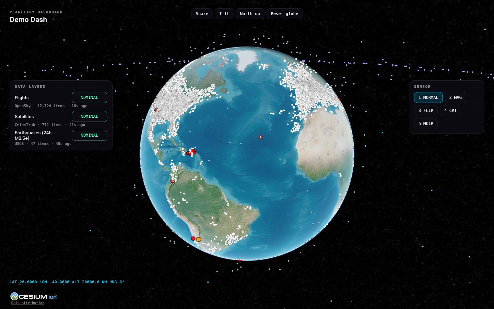

# Planetary Dashboard

Build 3D geospatial dashboards that look like a forbidden cockpit and hold up in production. Every pattern in this skill comes from three shipped codebases:

| Code | Project | Stack | What it proves |
|---|---|---|---|
| **GEV** | God's Eye View | Vanilla JS + CesiumJS + Vite middleware | 27 live layers, keyless-first, sensor shaders, tracking/cockpit, realtime voice agent, scene director, share links |
| **GS** | GeoSphere (`CyberdyneCorp/geo_dashboard`) | SvelteKit + Svelte 5 runes + Cesium; FastAPI hexagonal | MVVM on a globe, 25 feeds via SvelteKit proxies, polygon analysis, STAC indices, RF, SSE, chat agent + MCP |
| **KZ** | KANZI (`aminitech/kanzi`) | SvelteKit + MapLibre 6 + Cesium lens; Python/GDAL pipeline | Digital twin, real-sun terrain, underground WebGL, provenance + snapshots, context packs, brandkits, sovereign deploy |



## Scope check: read this first

Use this skill when the **map is the product**, meaning a globe or 3D terrain is the main surface and live or analytical data sits on top of it. It is the wrong tool for a single static map on a web page (use a plain MapLibre embed), for GIS desktop work, or for 2D BI charts that merely contain a map.

## The five rules that separate good from impressive-but-broken

1. **Keyless first.** With **zero keys**, every capability still runs or clearly says *KEY REQUIRED*:
   - Imagery falls back Esri → OSM; terrain falls back Re:Earth or terrarium → ellipsoid.
   - Flights use OpenSky and fall back to adsb.lol; traffic is simulated along OSM roads.
   - Voice falls back to a typed-command parser.
   - Keys are upgrades. Only `GOOGLE_MAPS_API_KEY` and `CESIUM_ION_TOKEN` may ever reach the browser.
2. **Every feed goes through a same-origin proxy** that caches with single-flight, cools down after a 429, serves stale data on error, has timeouts and size caps, and accepts **IDs rather than URLs** (SSRF). Browser-direct calls are only for keyless public tiles and JSON.
3. **Show honest feed state everywhere.** Use one vocabulary: `nominal · loading · degraded · stale · partial · fallback · unavailable · off`. The panel, HUD, loading chip and AI agent all read the same snapshot. Stale data is never drawn or narrated as live. Legends carry trust labels (LIVE / MODEL / SIMULATED …).
4. **An idle globe renders nothing.** A render governor keeps `requestRenderMode` on unless a named hold exists (tracking, animation, playback). A hidden tab stops rendering and polling.
5. **One layer contract and one registry.** The toggle UI, share-link tokens, pick routing, analyst records and agent tools are all *generated* from it. Hand-written 1,900-line layer panels and duplicated tool lists drift apart.

## Workflow

### 1. Frame it (5 questions, then decide)
- **Audience and stakes.** Is this a demo or wow piece (GEV), an analyst tool (GS), or a decision or sovereign client (KZ)? Decision tools need provenance, trust labels and honest refusal.
- **Scale.** Whole planet → **Cesium**. Country or site with terrain and buildings → **MapLibre**. Both → MapLibre views plus a Cesium "lens". See `references/architecture.md` §1.
- **Data.** Run `python3 planetary_dashboard.py sources --keyless` and pick feeds, then check they are up with `probe`. Note the licences; some are non-commercial (TeleGeography cables, Nepal flood data, FAO).
- **Backend.** Is a thin proxy layer enough, or is there real compute (indices, RF, risk, jobs)? See `references/backend-patterns.md`.
- **Offline / sovereign.** If yes, self-host tiles, fonts and Cesium assets, use a local LLM, and run the manifest pipeline (`references/pipelines-and-deploy.md`).

### 2. Scaffold
```bash
python3 ~/.claude/skills/planetary-dashboard/planetary_dashboard.py scaffold ./my-globe --name "Atlas"
cd my-globe && npm install && npm run dev      # http://localhost:4173, no keys needed
npm test                                       # feed state, layer manager, share links, governor
```
The starter is vanilla JS + Vite + Cesium with no framework lock-in. It includes:
- A keyless globe with automatic fallbacks.
- `LayerManager` with serialized toggles.
- Feed-state panel, render governor, share-link hash, 5 sensor shaders (NORMAL/NVG/FLIR/CRT/NOIR), and a HUD.
- Click-to-inspect with a 6 px drag tolerance.
- Proxies for CelesTrak (disk-cached, group allowlist) and OpenSky (optional OAuth, cooldown, stale).
- Three live layers: flights, satellites (SGP4) and earthquakes.

On SvelteKit, port it using the MVVM layout in `references/architecture.md` §3B and the build gotchas in §8 (no `vite-plugin-cesium`).

### 3. Add layers (repeat per feed)
1. Find or verify the source: `sources --category <cat>`, `probe --id <id>`.
2. Add a proxy route if the source needs a key, rate limiting or SSRF care (`references/proxies.md` §1–6).
3. Write the layer to the contract (`references/architecture.md` §4). Choose the render primitive by object count (`references/rendering.md` §A3). Report `getStats()` honestly: `stale`, `fallback`, `partial`, `error`.
4. Add a share-link token and a panel group, then register the layer.
5. Add a fixture-based normalizer test (`references/quality.md` §1).

### 4. Add the features that make it feel expensive
Pick from `references/features.md`, which is tiered:
- **Core:** search chain, share links, tracking cards, credits.
- **Situational:** staged context modes, 250 km contacts roster, cockpit with regional brief, place-context panel, weather timeline, camera handoff.
- **Analysis:** draw and analyse polygons, terrain profile / LOS / RF, choropleths, recent-imagery box with swipe, scenario economics, trust-gated rankings.
- **Wow:** scene director and URL tours, swipe and time slider, digital twin with underground, sensor styles, detection overlay, voice agent, recording mode.

Visual recipes are in `references/rendering.md`: dead-reckoned motion 30 s behind real time, 3D model swap under 800 km, FIRMS LOD, wind streamlines, and MapLibre real-sun terrain, roof caps and glow edges. UI rules are in `references/ui-design.md`: tokens, layout, feed-state toggles, cockpit HUD, first-run launcher, accessibility.

### 5. Add AI (optional, but it's the showstopper)
See `references/ai-agents.md`:
- A realtime voice agent over WebRTC with a server-minted ephemeral secret.
- Around 30 globe tools, confirming only when `ok: true`.
- A cost cap.
- An analyst engine for grounded counts that always cite feed provenance.
- For analysis-heavy apps, an SSE chat agent that receives a `<DASHBOARD_CONTEXT>` preamble and a `map_action` event channel.

### 6. Verify before claiming done
- `npm test`, the build, and the import-boundary script.
- Offline e2e: mock `/api/*` and abort tile hosts.
- A screenshot harness against the dev server. Look at the screenshots: WebGL bugs don't show up in unit tests.
- Walk the pre-ship checklist in `references/quality.md` §6. Always test **zero keys**, **stale upstream** (kill the network and confirm STALE, not a blank or fake-live display) and **share-link restore**.
- Consider onboarding the project with the `openspec-baseline` skill.

## Reference map

| File | Read when |
|---|---|
| `references/architecture.md` | Choosing an engine, app skeleton (phased / MVVM / manifest), layer contract, feed state, coordination primitives, build gotchas |
| `references/proxies.md` | Writing any `/api/*` route: response contract, cache TTL table, rate limits both ways, fallback chains, WebSocket feeds, SSRF, key hygiene |
| `references/sources.json` | Machine-readable catalog of 50 public sources (URL, auth, browser vs proxy, refresh, limits, licence) |
| `references/rendering.md` | Cesium primitives and LOD, motion and tracking, sensor shaders, detection overlay, weather fields; MapLibre terrain, extrusions, custom WebGL, glTF |
| `references/ui-design.md` | Tokens, layout, layer panel, cockpit HUD, first-run, accessibility, charts, brandkits and i18n |
| `references/features.md` | Feature catalog by tier with constants and pitfalls |
| `references/ai-agents.md` | Voice agent, tool catalog, analyst engine, SSE chat agent, annotations, evidence-first answers |
| `references/backend-patterns.md` | Hexagonal FastAPI: one use case behind HTTP, MCP and agent; jobs; SSE from threads; PNG+bbox rasters; STAC indices; RF; RLS tenancy |
| `references/pipelines-and-deploy.md` | Source registry, backups and snapshots, GDAL normalisation, manifests, EO stage, context packs, sovereign or offline deploy |
| `references/quality.md` | Unit, contract-pin, architecture-gate, offline e2e and screenshot layers, plus the pre-ship checklist |

## CLI

```bash
python3 planetary_dashboard.py sources [--category aviation] [--keyless] [--browser] [--json]
python3 planetary_dashboard.py probe [--id opensky --id celestrak] [--category weather] [--keyless] [--timeout 8] [--json]
python3 planetary_dashboard.py scaffold <dir> [--name "Display Name"]
```
`probe` sends a small ranged GET to each source's probe URL. It reports `UP | GATED (401/403) | THROTTLED (429) | DOWN | SKIPPED` and exits with code 2 if any source is down. Use it before a demo, and in a cron job for a connector-health board (KZ pattern).

## Anti-patterns seen in the wild (don't repeat them)
- The README promises features the code doesn't have: camera handoff, "exact view back", fading trails. Keep claims pinned by tests or remove them.
- Upstream fetches with **no timeout** on the busiest feed, and unbounded disk caches keyed on user input.
- A camera-frame proxy whose Street View fallback accepts arbitrary coordinates, turning it into an open, billable proxy.
- Voice transcripts logged to disk by default. Token-minting routes that accept GET or have no throttle.
- A feed-state severity table missing a state, so the agent says "off" for a layer that is actually partial.
- Satellites re-positioned from a UI framework effect every second instead of the Cesium clock. Aurora or grids drawn as thousands of rectangles instead of one canvas imagery layer.
- A 16 MB GeoJSON shipped whole instead of PMTiles. Unkeyed CARTO raster tiles, which come back watermarked.
- `vite-plugin-cesium` under SvelteKit, which causes a TDZ crash in production builds. A MapLibre 6 worker that isn't pinned.
